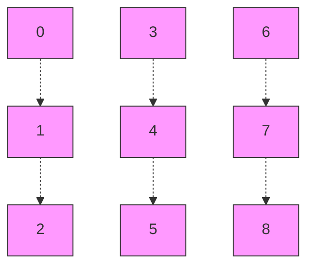
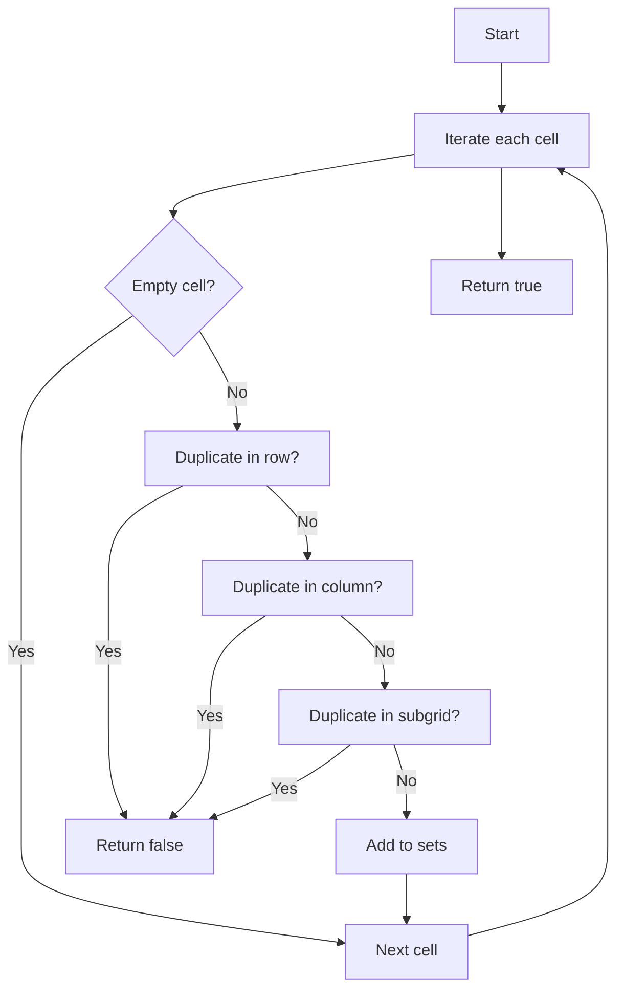

## Introduction

How can you tell if a Sudoku board is valid without solving it? This challenge, part of the [LeetCode Top Interview 150 series](https://leetcode.com/studyplan/top-interview-150/), is a classic technical interview question. We will validate a 9x9 Sudoku board efficiently—not solve it, nor check if it is solvable, just ensure it follows the basic Sudoku rules.

## Problem Statement

> Given a 9x9 Sudoku board, determine if it is valid according to the following rules:

1. **Rows**: Each row must contain the digits 1-9 without repetition.
2. **Columns**: Each column must contain the digits 1-9 without repetition.
3. **3x3 Subgrids**: Each of the 9 subgrids must contain the digits 1-9 without repetition.

The board is represented as a 2D array of characters, where `'.'` indicates an empty cell.

## Board and Subgrid Visualization

To understand how the 3x3 subgrids are grouped, see the following diagram:



Each cell $(i, j)$ belongs to a subgrid calculated as:

$$
	ext{boxIndex} = \left\lfloor \frac{i}{3} \right\rfloor \times 3 + \left\lfloor \frac{j}{3} \right\rfloor
$$

## Strategy and Analysis

The goal is to validate rows, columns, and subgrids in **a single pass**. We'll use `Set` to track seen digits for each row, column, and subgrid. Why `Sets`? Because they allow duplicate checks in average constant time, meaning each time we see a number, we can check if we've seen it before in $O(1)$ time on average.

### How do I identify a cell's subgrid?

The key formula is:

$$
	ext{boxIndex} = \left\lfloor \frac{i}{3} \right\rfloor \times 3 + \left\lfloor \frac{j}{3} \right\rfloor
$$

**Example:**

```typescript
// For cell (row 5, column 7):
const boxIndex = Math.floor(5 / 3) * 3 + Math.floor(7 / 3) // = 1*3 + 2 = 5
```

This maps the 9x9 board to a 3x3 grid of subgrids numbered 0 to 8.

## TypeScript Implementation

```typescript
export function isValidSudoku(board: string[][]): boolean {
  // Create sets for rows, columns, and subgrids
  const rows: Set<string>[] = Array.from({ length: 9 }, () => new Set())
  const cols: Set<string>[] = Array.from({ length: 9 }, () => new Set())
  const boxes: Set<string>[] = Array.from({ length: 9 }, () => new Set())

  for (let i = 0; i < 9; i++) {
    for (let j = 0; j < 9; j++) {
      const num = board[i][j]
      if (num === '.')
        continue

      if (rows[i].has(num))
        return false
      rows[i].add(num)

      if (cols[j].has(num))
        return false
      cols[j].add(num)

      const boxIndex = Math.floor(i / 3) * 3 + Math.floor(j / 3)
      if (boxes[boxIndex].has(num))
        return false
      boxes[boxIndex].add(num)
    }
  }
  return true
}
```

### Example Usage and Test Case

```typescript
const board = [
  ['5', '3', '.', '.', '7', '.', '.', '.', '.'],
  ['6', '.', '.', '1', '9', '5', '.', '.', '.'],
  ['.', '9', '8', '.', '.', '.', '.', '6', '.'],
  ['8', '.', '.', '.', '6', '.', '.', '.', '3'],
  ['4', '.', '.', '8', '.', '3', '.', '.', '1'],
  ['7', '.', '.', '.', '2', '.', '.', '.', '6'],
  ['.', '6', '.', '.', '.', '.', '2', '8', '.'],
  ['.', '.', '.', '4', '1', '9', '.', '.', '5'],
  ['.', '.', '.', '.', '8', '.', '.', '7', '9']
]
console.log(isValidSudoku(board)) // true
```

## Complexity Analysis

The solution is very efficient because the board size is fixed ($9 \times 9$):

- **Time:**
	- $O(1)$ (in practice, $O(n^2)$ for an $n \times n$ board)
	- Each cell is visited once and `Set` operations are $O(1)$ on average.
- **Space:**
	- $O(1)$ (27 sets, each with up to 9 elements)

## Key Patterns and Techniques

1. **Hash Set for Duplicate Detection**
	- Allows $O(1)$ validation per cell.
2. **2D to 1D Coordinate Mapping**
	- Useful for subgrids and other matrix problems.
3. **Simultaneous Validation**
	- Rows, columns, and subgrids in a single pass.
4. **Early Return**
	- Returns `false` at the first error, optimizing for invalid cases.
5. **Safe Array Initialization**
	- `Array.from({length: 9}, () => new Set())` avoids shared references.



## Conclusion

This pattern of simultaneous validation and hash set usage is very useful in matrix and constraint problems. It's efficient, clear, and easy to adapt to larger variants or different rules.
