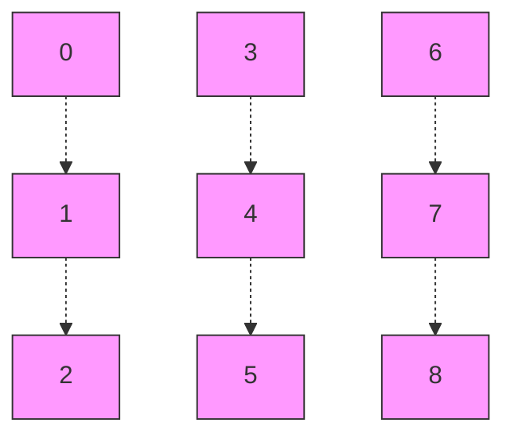
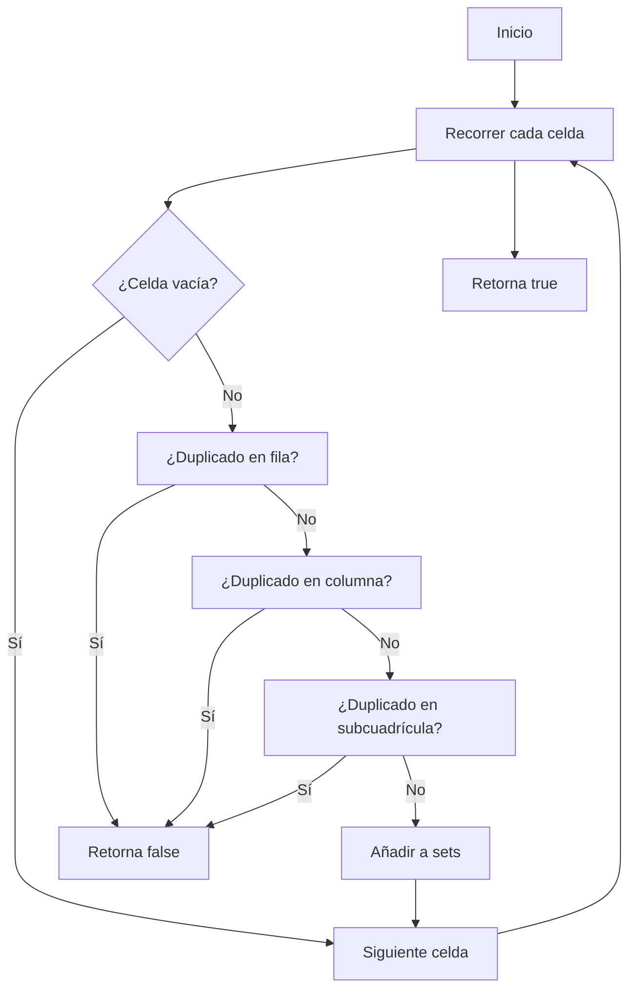

## Introducción

¿Cómo saber si un tablero de Sudoku es válido sin resolverlo? Este desafío, parte de la serie [Top Interview 150 de LeetCode](https://leetcode.com/studyplan/top-interview-150/), es un clásico de entrevistas técnicas. Vamos a validar un Sudoku 9x9 de forma eficiente, no resolverlo ni siquiera ver si es resoluble, solamente que cumpla las reglas básicas del Sudoku.

## Enunciado del Problema

> Dado un tablero de Sudoku 9x9, determina si es válido según las siguientes reglas:

1. **Filas**: Cada fila debe contener los dígitos del 1 al 9 sin repetir.
2. **Columnas**: Cada columna debe contener los dígitos del 1 al 9 sin repetir.
3. **Subcuadrículas 3x3**: Cada una de las 9 subcuadrículas debe contener los dígitos del 1 al 9 sin repetir.

El tablero se representa como una matriz 2D de caracteres, donde `'.'` indica una celda vacía.

## Visualización del Tablero y Subcuadrículas

Para entender cómo se agrupan las subcuadrículas 3x3, observa el siguiente diagrama:



Cada celda $(i, j)$ pertenece a una subcuadrícula calculada así:

$$
	ext{boxIndex} = \left\lfloor \frac{i}{3} \right\rfloor \times 3 + \left\lfloor \frac{j}{3} \right\rfloor
$$

## Estrategia y Análisis

El objetivo es validar filas, columnas y subcuadrículas en **una sola pasada**. Vamos a usar `Set` para rastrear los dígitos vistos en cada fila, columna y subcuadrícula. ¿Por qué `Sets`? por que permiten verificar duplicados en tiempo constante promedio, esto quiere decir que cada vez que vemos un número, podemos en promedio verificar si ya lo hemos visto antes en $O(1)$ tiempo.

### ¿Cómo identifico la subcuadrícula de una celda?

La fórmula clave es:

$$
	ext{boxIndex} = \left\lfloor \frac{i}{3} \right\rfloor \times 3 + \left\lfloor \frac{j}{3} \right\rfloor
$$

**Ejemplo:**

```typescript
// Para la celda (fila 5, columna 7):
const boxIndex = Math.floor(5 / 3) * 3 + Math.floor(7 / 3) // = 1*3 + 2 = 5
```

Esto mapea el tablero 9x9 a una matriz 3x3 de subcuadrículas numeradas del 0 al 8.

## Implementación en TypeScript

```typescript
export function isValidSudoku(board: string[][]): boolean {
  // Creamos sets para filas, columnas y subcuadrículas
  const rows: Set<string>[] = Array.from({ length: 9 }, () => new Set())
  const cols: Set<string>[] = Array.from({ length: 9 }, () => new Set())
  const boxes: Set<string>[] = Array.from({ length: 9 }, () => new Set())

  for (let i = 0; i < 9; i++) {
    for (let j = 0; j < 9; j++) {
      const num = board[i][j]
      if (num === '.')
        continue

      if (rows[i].has(num))
        return false
      rows[i].add(num)

      if (cols[j].has(num))
        return false
      cols[j].add(num)

      const boxIndex = Math.floor(i / 3) * 3 + Math.floor(j / 3)
      if (boxes[boxIndex].has(num))
        return false
      boxes[boxIndex].add(num)
    }
  }
  return true
}
```

### Ejemplo de uso y test case

```typescript
const board = [
  ['5', '3', '.', '.', '7', '.', '.', '.', '.'],
  ['6', '.', '.', '1', '9', '5', '.', '.', '.'],
  ['.', '9', '8', '.', '.', '.', '.', '6', '.'],
  ['8', '.', '.', '.', '6', '.', '.', '.', '3'],
  ['4', '.', '.', '8', '.', '3', '.', '.', '1'],
  ['7', '.', '.', '.', '2', '.', '.', '.', '6'],
  ['.', '6', '.', '.', '.', '.', '2', '8', '.'],
  ['.', '.', '.', '4', '1', '9', '.', '.', '5'],
  ['.', '.', '.', '.', '8', '.', '.', '7', '9']
]
console.log(isValidSudoku(board)) // true
```

## Análisis de Complejidad

La solución es muy eficiente porque el tablero es de tamaño fijo ($9 \times 9$):

- **Tiempo:**
  - $O(1)$ (en la práctica, $O(n^2)$ para un tablero $n \times n$)
  - Cada celda se visita una vez y las operaciones de `Set` son $O(1)$ promedio.
- **Espacio:**
  - $O(1)$ (27 sets, cada uno con hasta 9 elementos)

## Patrones y Técnicas Clave

1. **Hash Set para Detección de Duplicados**
  - Permite validar restricciones en $O(1)$ por celda.
2. **Mapeo de Coordenadas 2D a 1D**
  - Útil para subcuadrículas y otros problemas de matrices.
3. **Validación Simultánea**
  - Filas, columnas y subcuadrículas en una sola pasada.
4. **Early Return**
  - Retorna `false` al primer error, optimizando casos inválidos.
5. **Inicialización Segura de Arrays**
  - `Array.from({length: 9}, () => new Set())` evita referencias compartidas.



## Conclusión

Este patrón de validación simultánea y uso de hash sets es muy útil en problemas de matrices y restricciones. Es eficiente, claro y fácil de adaptar a variantes más grandes o diferentes reglas
