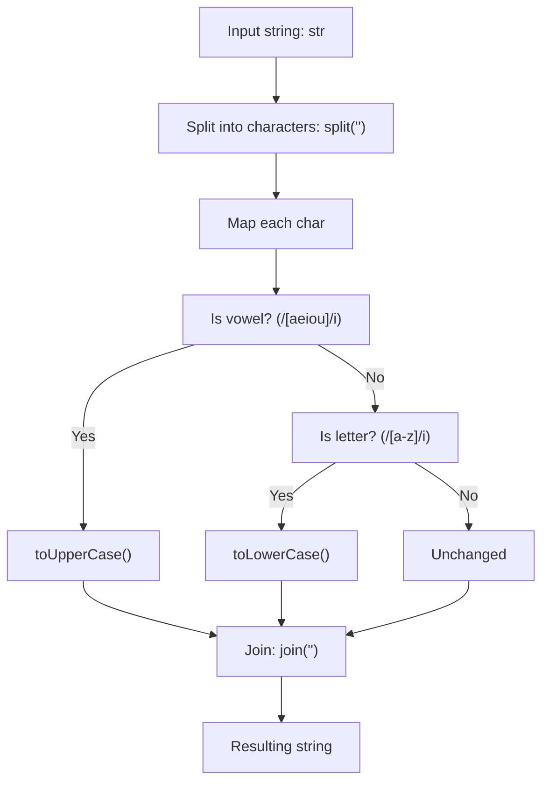

## Vowel Case - Analysis and Explanation

## Problem Statement

Given a string, return a new string where all vowels are in uppercase and the rest of the alphabetic characters are in lowercase.

- Vowels are: a, e, i, o, u.
- Non-alphabetic characters should not be modified.

## Initial Analysis

### Understanding the Problem

The `vowelCase` function receives a string `str` and must return a new string where:

- All vowels (a, e, i, o, u, in any case) are converted to uppercase.
- The rest of the alphabetic characters are converted to lowercase.
- Non-alphabetic characters (spaces, punctuation, numbers, etc.) remain unchanged.

The problem requires processing each character individually, checking its type and applying the corresponding transformation in a case-insensitive manner for vowels.

### Identified Test Cases

Based on the implemented tests, the cases cover various situations:

1. `vowelCase("vowelcase")` → `"vOwElcAsE"`: Lowercase string with vowels and consonants.
2. `vowelCase("coding is fun")` → `"cOdIng Is fUn"`: Includes spaces and mixed cases.
3. `vowelCase("HELLO, world!")` → `"hEllO, wOrld!"`: Initial capitals, punctuation and exclamation.
4. `vowelCase("git cherry-pick")` → `"gIt chErry-pIck"`: Hyphens and compound words.
5. `vowelCase("HEAD~1")` → `"hEAd~1"`: Numbers and special symbols.

These cases verify correct transformation, preservation of non-alphabetics, and handling of different input cases.

## Process Visualization



## Solution Development

### Chosen Approach

The approach is functional and uses regular expressions to classify characters efficiently and case-insensitively: convert the string to an array, map each character with regex to detect vowels (uppercase) or non-vowel letters (lowercase), and join. This is readable, concise, and avoids unnecessary auxiliary arrays.

### Step-by-Step Implementation

1. Convert `str` to array with `split('')`.
2. Use `map` for each `char`:
   - If `char` is vowel (regex `/[aeiou]/i`), return `char.toUpperCase()`.
   - If not, and `char` is letter (regex `/[a-z]/i`), return `char.toLowerCase()`.
   - Otherwise, return `char` unchanged.
3. Join the array with `join('')` and return the result.

### Complete Code

```javascript
/**
 * FreeCodeCamp Problem: Vowel Case
 * Category: FreeCodeCamp
 *
 * @param {string} str - The input string to be transformed
 * @returns {string} The transformed string with vowels in uppercase and other letters in lowercase
 */
function vowelCase(str) {
  return str
    .split('')
    .map((char) => {
      if (/[aeiou]/i.test(char)) {
        return char.toUpperCase()
      }
      else if (/[a-z]/i.test(char)) {
        return char.toLowerCase()
      }
      else {
        return char
      }
    })
    .join('')
}

export default vowelCase
```

## Complexity Analysis

### Time Complexity

O(n), where n is the length of the string. `split`, `map`, and `join` iterate once over each character.

### Space Complexity

O(n), due to the intermediate array created by `split` and `map`. No additional significant structures are used.

## Edge Cases and Considerations

- Empty strings: Returns empty string (no errors).
- Strings without letters: Remain unchanged (e.g., "123!@#").
- Vowels in uppercase: Correctly converted to uppercase (e.g., "A" → "A").
- No input validation, assuming always a string.
- Uses regex to check alphabetic letters, which is more readable and robust for ASCII characters.

## Reflections and Learnings

### Applied Concepts

- String manipulation: Conversion to array for functional transformation.
- Array methods: `map` for iteration and transformation.
- Regular expressions: Use of regex (`/[aeiou]/i` and `/[a-z]/i`) to detect vowels and letters in a case-insensitive and efficient manner.
- Conditionals: Simple logic for classifying characters.

### Possible Optimizations

The code is optimal: O(n) time and space. Using regex makes detection more readable and robust than manual comparisons. No precomputation is necessary, as regex is evaluated per character.

## Resources and References

- [FreeCodeCamp Daily Coding Challenge](https://www.freecodecamp.org/learn/daily-coding-challenge/2026-01-06/)
- Related concepts: String manipulation in JavaScript, functional array methods.
