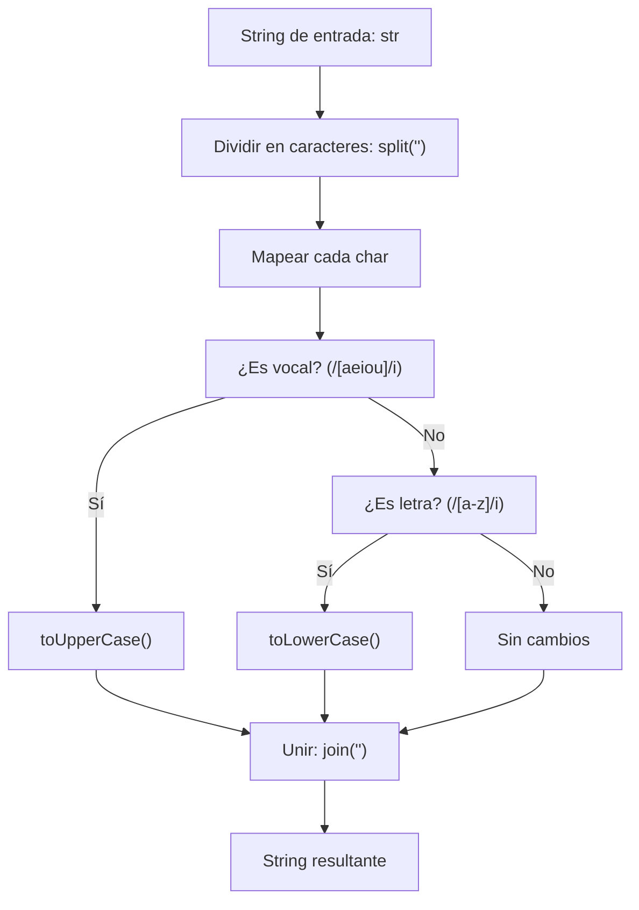

## Vowel Case - Análisis y Explicación

## Enunciado del Problema

Dado un string, retorna un nuevo string donde todas las vocales estén en mayúsculas y el resto de los caracteres alfabéticos en minúsculas.

- Las vocales son: a, e, i, o, u.
- No se deben modificar los caracteres no alfabéticos.

## Análisis Inicial

### Comprensión del Problema

La función `vowelCase` recibe un string `str` y debe devolver un nuevo string donde:

- Todas las vocales (a, e, i, o, u, en cualquier caso) se conviertan a mayúsculas.
- El resto de los caracteres alfabéticos se conviertan a minúsculas.
- Los caracteres no alfabéticos (espacios, puntuación, números, etc.) queden sin cambios.

El problema requiere procesar cada carácter individualmente, verificando su tipo y aplicando la transformación correspondiente de manera case-insensitive para las vocales.

### Casos de Prueba Identificados

Basado en los tests implementados, los casos cubren diversas situaciones:

1. `vowelCase("vowelcase")` → `"vOwElcAsE"`: String en minúsculas con vocales y consonantes.
2. `vowelCase("coding is fun")` → `"cOdIng Is fUn"`: Incluye espacios y mezcla de casos.
3. `vowelCase("HELLO, world!")` → `"hEllO, wOrld!"`: Mayúsculas iniciales, puntuación y exclamación.
4. `vowelCase("git cherry-pick")` → `"gIt chErry-pIck"`: Guiones y palabras compuestas.
5. `vowelCase("HEAD~1")` → `"hEAd~1"`: Números y símbolos especiales.

Estos casos verifican la transformación correcta, preservación de no alfabéticos y manejo de diferentes casos de entrada.

## Visualización del Proceso



## Desarrollo de la Solución

### Enfoque Elegido

El enfoque es funcional y usa expresiones regulares para clasificar caracteres de manera eficiente y case-insensitive: convertir el string en array, mapear cada carácter con regex para detectar vocales (mayúscula) o letras no vocales (minúscula), y unir. Esto es legible, conciso y evita arrays auxiliares innecesarios.

### Implementación Paso a Paso

1. Convertir `str` a array con `split('')`.
2. Usar `map` para cada `char`:
   - Si `char` es vocal (regex `/[aeiou]/i`), retornar `char.toUpperCase()`.
   - Si no, y `char` es letra (regex `/[a-z]/i`), retornar `char.toLowerCase()`.
   - De lo contrario, retornar `char` sin cambios.
3. Unir el array con `join('')` y retornar el resultado.

### Código Completo

```javascript
/**
 * FreeCodeCamp Problem: Vowel Case
 * Category: FreeCodeCamp
 *
 * @param {string} str - The input string to be transformed
 * @returns {string} The transformed string with vowels in uppercase and other letters in lowercase
 */
function vowelCase(str) {
  return str
    .split('')
    .map((char) => {
      if (/[aeiou]/i.test(char)) {
        return char.toUpperCase()
      }
      else if (/[a-z]/i.test(char)) {
        return char.toLowerCase()
      }
      else {
        return char
      }
    })
    .join('')
}

export default vowelCase
```

## Análisis de Complejidad

### Complejidad Temporal

O(n), donde n es la longitud del string. `split`, `map` y `join` iteran una vez sobre cada carácter.

### Complejidad Espacial

O(n), debido al array intermedio creado por `split` y `map`. No se usan estructuras adicionales significativas.

## Casos Edge y Consideraciones

- Strings vacíos: Retorna string vacío (sin errores).
- Strings sin letras: Quedan sin cambios (ej. "123!@#").
- Vocales en mayúsculas: Se convierten correctamente a mayúsculas (ej. "A" → "A").
- No hay validación de entrada, asumiendo siempre un string.
- Usa regex para verificar letras alfabéticas, lo que es más legible y robusto para caracteres ASCII.

## Reflexiones y Aprendizajes

### Conceptos Aplicados

- Manipulación de strings: Conversión a array para transformación funcional.
- Métodos de arrays: `map` para iteración y transformación.
- Expresiones regulares: Uso de regex (`/[aeiou]/i` y `/[a-z]/i`) para detectar vocales y letras de manera case-insensitive y eficiente.
- Condicionales: Lógica simple para clasificar caracteres.

### Posibles Optimizaciones

El código es óptimo: O(n) tiempo y espacio. Usar regex hace la detección más legible y robusta que comparaciones manuales. No hay precomputación necesaria, ya que regex se evalúa por carácter.

## Recursos y Referencias

- [FreeCodeCamp Daily Coding Challenge](https://www.freecodecamp.org/learn/daily-coding-challenge/2026-01-06/)
- Conceptos relacionados: Manipulación de strings en JavaScript, métodos de arrays funcionales.
