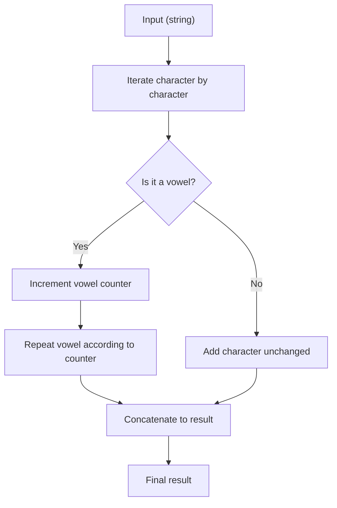

## Vowel Repeater - Analysis and Explanation

## Problem Statement

Given a string, return a new version where each vowel is repeated one more time than the previous one. For example: the first vowel stays the same, the second appears twice, the third three times, and so on. All other characters remain unchanged.

## Initial Analysis

What does the challenge ask? Manipulate the string so that each vowel is repeated progressively more times according to its order of appearance. All other characters remain the same.

**Key rules:**
- The first vowel is not repeated.
- The second vowel appears twice, the third three times, etc.
- The original case is kept only for the first appearance of each vowel; extra repetitions are always lowercase.
- Non-vowels: unchanged.

### Test Cases

| Input | Expected Output |
|---|---|
| `"hello world"` | `"helloo wooorld"` |
| `"freeCodeCamp"` | `"freeeCooodeeeeCaaaaamp"` |
| `"AEIOU"` | `"AEeIiiOoooUuuuu"` |
| `"I like eating ice cream in Iceland"` | `"I liikeee eeeeaaaaatiiiiiing iiiiiiiceeeeeeee creeeeeeeeeaaaaaaaaaam iiiiiiiiiiin Iiiiiiiiiiiiceeeeeeeeeeeeelaaaaaaaaaaaaaand"` |



## Solution Development

### Strategy

We iterate through the string character by character. If we find a vowel, we increment a counter and repeat that vowel as many times as the counter indicates (first time once, second twice, etc). Extra repetitions are always lowercase, even if the original vowel is uppercase.

### Implementation

```javascript
// Repeats each vowel one more time than the previous one.
function repeatVowels(str) {
  let result = ''
  let vowelCount = 0
  const vowels = 'aeiouAEIOU'

  for (let char of str) {
    if (vowels.includes(char)) {
      vowelCount++
      // The first appearance keeps its case, extra repetitions are lowercase
      result += char + char.toLowerCase().repeat(vowelCount - 1)
    }
    else {
      result += char
    }
  }
  return result
}
```

## Complexity Analysis

- **Time:** $O(n)$, where $n$ is the length of the string. We only iterate once and each operation is $O(1)$.
- **Space:** $O(n)$, since the result can grow if there are many vowels.

## Edge Cases and Considerations

- Empty string → returns empty.
- No vowels → returns unchanged.
- Only vowels → each one is repeated progressively more.
- Uppercase/lowercase → extra repetitions are always lowercase.
- Special characters, numbers, spaces → unchanged.

## Reflections and Learnings

What did we learn?

- How to use an incremental counter for progressive logic.
- String manipulation and case control.

**What if the string is very long?**
We could use an array and then join with `join('')` to optimize memory.

**What if there are accented vowels?**
Just expand the vowel list or use a regular expression.

## Resources

- [MDN: String.prototype.repeat()](https://developer.mozilla.org/en-US/docs/Web/JavaScript/Reference/Global_Objects/String/repeat)
- [MDN: String.prototype.toLowerCase()](https://developer.mozilla.org/en-US/docs/Web/JavaScript/Reference/Global_Objects/String/toLowerCase)
