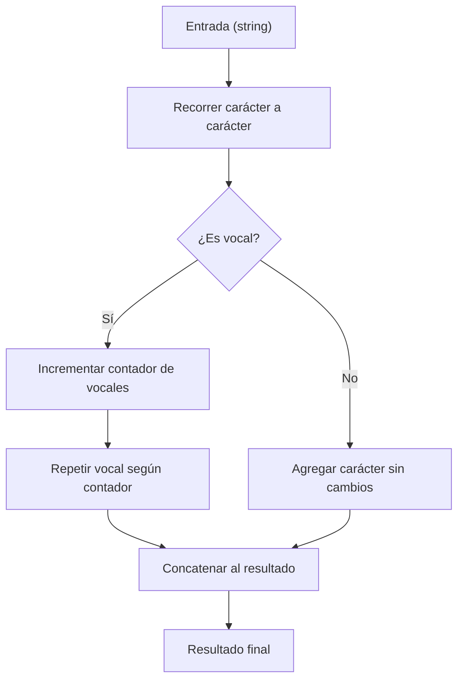

## Vowel Repeater - Análisis y Explicación

## Enunciado

Dado un string, devuelve una nueva versión donde cada vocal se repite una vez más que la anterior. Ejemplo: la primera vocal queda igual, la segunda aparece dos veces, la tercera tres, etc. El resto de los caracteres no cambia.

## Análisis Inicial

¿Qué pide el reto? Manipular el string para que cada vocal se repita progresivamente más veces según su orden de aparición. El resto de los caracteres se mantiene igual.

**Reglas clave:**

- La primera vocal no se repite.
- La segunda vocal aparece dos veces, la tercera tres, etc.
- El case original solo se mantiene en la primera aparición de cada vocal; las repeticiones extra son minúsculas.
- No vocales: sin cambios.

### Casos de Prueba

| Entrada | Salida esperada |
|---|---|
| `"hello world"` | `"helloo wooorld"` |
| `"freeCodeCamp"` | `"freeeCooodeeeeCaaaaamp"` |
| `"AEIOU"` | `"AEeIiiOoooUuuuu"` |
| `"I like eating ice cream in Iceland"` | `"I liikeee eeeeaaaaatiiiiiing iiiiiiiceeeeeeee creeeeeeeeeaaaaaaaaaam iiiiiiiiiiin Iiiiiiiiiiiiceeeeeeeeeeeeelaaaaaaaaaaaaaand"` |



## Desarrollo de la Solución

### Estrategia

Recorremos el string carácter por carácter. Si encontramos una vocal, incrementamos un contador y repetimos esa vocal tantas veces como indique el contador (la primera vez una vez, la segunda dos, etc). Las repeticiones extra siempre en minúscula, aunque la vocal original sea mayúscula.

### Implementación

```javascript
// Repite cada vocal una vez más que la anterior.
function repeatVowels(str) {
  let result = ''
  let vowelCount = 0
  const vowels = 'aeiouAEIOU'

  for (let char of str) {
    if (vowels.includes(char)) {
      vowelCount++
      // La primera aparición mantiene el case, las repeticiones extra son minúsculas
      result += char + char.toLowerCase().repeat(vowelCount - 1)
    }
    else {
      result += char
    }
  }
  return result
}
```

## Análisis de Complejidad

- **Tiempo:** $O(n)$, donde $n$ es la longitud del string. Solo recorremos una vez y cada operación es $O(1)$.
- **Espacio:** $O(n)$, ya que el resultado puede crecer si hay muchas vocales.

## Casos Edge y Consideraciones

- String vacío → retorna vacío.
- Sin vocales → retorna igual.
- Solo vocales → cada una se repite progresivamente más.
- Mayúsculas/minúsculas → repeticiones extra siempre minúsculas.
- Caracteres especiales, números, espacios → sin cambios.

## Reflexiones y Aprendizajes

¿Qué aprendimos?
- Cómo usar un contador incremental para lógica progresiva.
- Manipulación de strings y control de case.

**¿Y si el string es muy largo?**
Podríamos usar un array y luego unir con `join('')` para optimizar memoria.

**¿Y si hay vocales acentuadas?**
Basta con ampliar la lista de vocales o usar una expresión regular.

## Recursos

- [MDN: String.prototype.repeat()](https://developer.mozilla.org/en-US/docs/Web/JavaScript/Reference/Global_Objects/String/repeat)
- [MDN: String.prototype.toLowerCase()](https://developer.mozilla.org/en-US/docs/Web/JavaScript/Reference/Global_Objects/String/toLowerCase)
