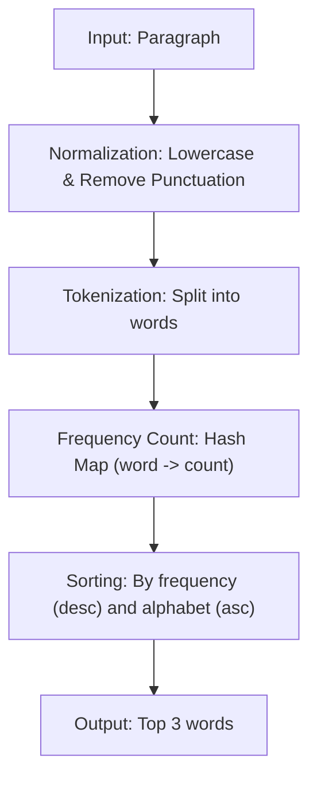

## The Challenge

The goal is to write a function that takes a string (a paragraph) and returns an array of the **top 3 most frequent words**, ordered from highest to lowest frequency.

### Requirements

- Words are case-insensitive (e.g., "The" and "the" are the same).
- Punctuation like dots (`.`), commas (`,`), and exclamation marks (`!`) should be ignored.
- If there is a tie in frequency, words should be sorted alphabetically.
- If the paragraph has fewer than 3 unique words, return all of them.

---

## Initial Analysis

To solve this problem, we need a pipeline that transforms raw text into a sorted list of frequencies.

### Logic Pipeline



---

## Implementation

We will use a **Hash Map** (a plain JavaScript object) to store frequencies and the `sort()` method with a custom comparator for the final ranking.

```javascript
/**
 * Finds the top 3 most frequent words in a paragraph.
 * @param {string} paragraph - The text to analyze.
 * @returns {string[]} Array with the top 3 words.
 */
function getWords(paragraph) {
  if (!paragraph || typeof paragraph !== 'string') {
    return []
  }

  // 1. Normalize to lowercase and remove specific punctuation (.,!)
  const words = paragraph
    .toLowerCase()
    .replace(/[.,!]/g, '')
    .split(/\s+/)
    .filter(word => word.length > 0)

  // 2. Count frequencies using an object as a Hash Map
  const frequencyMap = {}
  for (const word of words) {
    frequencyMap[word] = (frequencyMap[word] || 0) + 1
  }

  // 3. Sort by descending frequency
  // In case of a tie, use alphabetical order for consistency
  return Object.keys(frequencyMap)
    .sort((a, b) => {
      const freqDiff = frequencyMap[b] - frequencyMap[a]
      if (freqDiff !== 0) {
        return freqDiff
      }
      return a.localeCompare(b)
    })
    .slice(0, 3)
}
```

---

## Complexity Analysis

### Temporal: $O(n + m \log m)$

- **String Processing**: $O(n)$, where $n$ is the length of the paragraph. `toLowerCase`, `replace`, and `split` traverse the string linearly.
- **Frequency Counting**: $O(w)$, where $w$ is the total number of words.
- **Sorting**: $O(m \log m)$, where $m$ is the number of unique words.
- **Total**: $O(n + m \log m)$. In practice, $m$ is usually much smaller than $n$.

### Spatial: $O(w)$

- **Frequency Map**: $O(m)$, where $m$ is the number of unique words.
- **Word Array**: $O(w)$, to store the extracted tokens.
- **Total**: $O(w)$, proportional to the number of words in the input.

---

## Edge Cases

### ✅ Handled Correctly

| Case | Result | Note |
|------|-----------|------|
| Empty paragraph | `[]` | Safe return |
| Fewer than 3 words | `["word1", "word2"]` | `slice` handles boundaries |
| Multiple spaces | `["a", "b"]` | Regex `\s+` avoids empty tokens |
| Only punctuation | `[]` | Length filter cleans the result |

---

## Reflections

### Key Concepts

- **Data Normalization**: Converting to a base format (lowercase, no punctuation) simplifies counting.
- **Hash Maps**: Ideal structure for frequency counting due to $O(1)$ access.
- **Sorting Stability**: Defining a secondary criterion (alphabetical) ensures deterministic results.

### Possible Optimizations

If the paragraph were massive and we only needed the top $k$, we could use a **Min-Heap** of size $k$ to reduce sorting complexity from $O(m \log m)$ to $O(m \log k)$.

---

## Resources

- [MDN - String.prototype.replace()](https://developer.mozilla.org/en-US/docs/Web/JavaScript/Reference/Global_Objects/String/replace)
- [MDN - Array.prototype.sort()](https://developer.mozilla.org/en-US/docs/Web/JavaScript/Reference/Global_Objects/Array/sort)
- [Regular Expressions in JS](https://developer.mozilla.org/en-US/docs/Web/JavaScript/Guide/Regular_Expressions)
