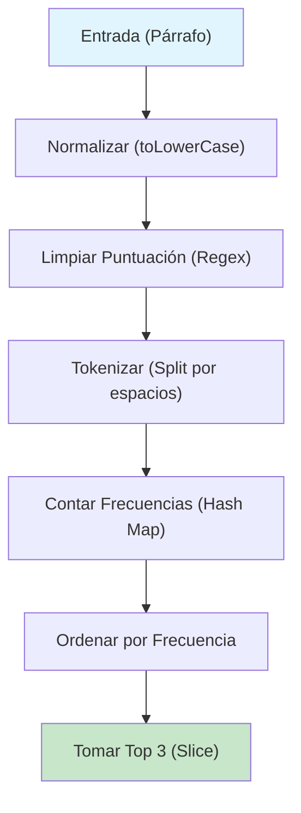

## Enunciado

Dado un párrafo, retorna un array con las **tres palabras** que se repiten con mayor frecuencia.

- Las palabras del párrafo estarán separadas por espacios.
- Ignora mayúsculas y minúsculas.
- Ignora signos de puntuación específicos: comas (`,`), puntos (`.`) y signos de exclamación (`!`).
- El array retornado deberá contener las palabras en minúsculas.
- El array retornado deberá estar ordenado en orden descendente por frecuencia.

## Análisis Inicial

### Objetivo

El objetivo es procesar un texto para extraer estadísticas de frecuencia de palabras. Debemos limpiar el texto de ruidos (puntuación y mayúsculas), tokenizarlo (dividirlo en palabras), contar las ocurrencias de cada una y finalmente seleccionar el "top 3".

### Casos de Prueba

| Entrada | Salida | Nota |
|---------|--------|------|
| `"Coding in Python is fun because coding Python allows for coding in Python easily while coding"` | `["coding", "python", "in"]` | Párrafo estándar |
| `"I like coding. I like testing. I love debugging!"` | `["i", "like", "coding"]` | Con puntuación |
| `"Debug, test, deploy. Debug, debug, test, deploy. Debug, test, test, deploy!"` | `["debug", "test", "deploy"]` | Empates en frecuencia |

### Estrategia: Pipeline de Procesamiento



## Implementación

```javascript
/**
 * Encuentra las tres palabras más frecuentes en un párrafo.
 * @param {string} paragraph - El texto a analizar.
 * @returns {string[]} Array con las 3 palabras más frecuentes.
 */
function getWords(paragraph) {
  if (!paragraph || typeof paragraph !== 'string') {
    return []
  }

  // 1. Normalizar a minúsculas y eliminar puntuación específica (.,!)
  const words = paragraph
    .toLowerCase()
    .replace(/[.,!]/g, '')
    .split(/\s+/)
    .filter(word => word.length > 0)

  // 2. Contar frecuencias usando un objeto como Hash Map
  const frequencyMap = {}
  for (const word of words) {
    frequencyMap[word] = (frequencyMap[word] || 0) + 1
  }

  // 3. Ordenar por frecuencia descendente
  // En caso de empate, usamos orden alfabético para mantener consistencia
  return Object.keys(frequencyMap)
    .sort((a, b) => {
      const freqDiff = frequencyMap[b] - frequencyMap[a]
      if (freqDiff !== 0) {
        return freqDiff
      }
      return a.localeCompare(b)
    })
    .slice(0, 3)
}
```

## Análisis de Complejidad

### Temporal: $O(n + m \log m)$

- **Procesamiento del String**: $O(n)$, donde $n$ es la longitud del párrafo. Las operaciones `toLowerCase`, `replace` y `split` recorren el string linealmente.
- **Conteo de Frecuencias**: $O(w)$, donde $w$ es el número total de palabras.
- **Ordenamiento**: $O(m \log m)$, donde $m$ es el número de palabras únicas.
- **Total**: $O(n + m \log m)$. En la práctica, $m$ suele ser mucho menor que $n$.

### Espacial: $O(w)$

- **Mapa de Frecuencias**: $O(m)$, donde $m$ es el número de palabras únicas.
- **Array de Palabras**: $O(w)$, para almacenar los tokens extraídos.
- **Total**: $O(w)$, proporcional al número de palabras en la entrada.

## Casos Edge

### ✅ Manejados Correctamente

| Caso | Resultado | Nota |
|------|-----------|------|
| Párrafo vacío | `[]` | Retorno seguro |
| Menos de 3 palabras | `["palabra1", "palabra2"]` | `slice` maneja límites |
| Espacios múltiples | `["a", "b"]` | Regex `\s+` evita tokens vacíos |
| Solo puntuación | `[]` | El filtro de longitud limpia el resultado |

## Reflexiones

### Conceptos Clave

- **Normalización de Datos**: Convertir a un formato base (minúsculas, sin puntuación) simplifica el conteo.
- **Hash Maps**: Estructura ideal para conteo de frecuencias por su acceso $O(1)$.
- **Estabilidad en el Ordenamiento**: Definir un criterio secundario (alfabético) asegura resultados deterministas.

### Posibles Optimizaciones

Si el párrafo fuera masivo y solo necesitáramos el top $k$, podríamos usar un **Min-Heap** de tamaño $k$ para reducir la complejidad del ordenamiento de $O(m \log m)$ a $O(m \log k)$.

## Recursos

- [MDN - String.prototype.replace()](https://developer.mozilla.org/es/docs/Web/JavaScript/Reference/Global_Objects/String/replace)
- [MDN - Array.prototype.sort()](https://developer.mozilla.org/es/docs/Web/JavaScript/Reference/Global_Objects/Array/sort)
- [Expresiones Regulares en JS](https://developer.mozilla.org/es/docs/Web/JavaScript/Guide/Regular_Expressions)
