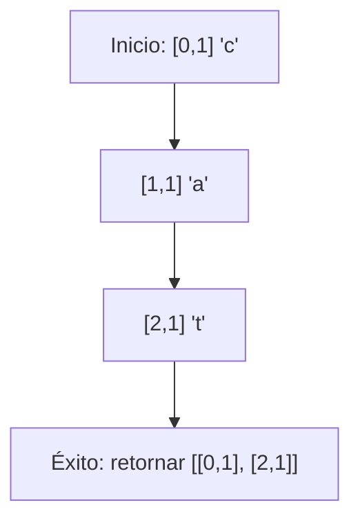

## Introduction

In this post, we will explore a classic algorithm problem: searching for a specific word in a 2D grid of letters.
The challenge is to find the start and end positions of a word that appears in a straight line (horizontal or vertical, including reversed directions) within a grid of lowercase letters.

## Problem Statement

Given a 2D matrix `matrix` of lowercase letters (a-z) and a target word `word`, we must return the start and end positions of that word if it appears exactly once in the matrix. The word can be oriented in any of the four main directions:

- Right (horizontal)
- Left (horizontal reversed)
- Down (vertical)
- Up (vertical reversed)

If the word is not found, we return `null`.

### Example

Consider the following matrix:

```text
[
  ["a", "c", "t"],
  ["t", "a", "t"],
  ["c", "t", "c"]
]
```

For the word `"cat"`, the function should return `[[0, 1], [2, 1]]`, as the word appears vertically from position `[0, 1]` ("c") to `[2, 1]` ("t").

## Approach and Analysis

### Initial Strategy

A straightforward approach is to traverse the entire matrix cell by cell. When we find a cell that matches the first letter of the word, we explore the four possible directions to check if the complete word forms along that path.

This approach ensures we find the word if it exists, as we cover all possible starting positions and valid orientations.

### Complexity Analysis

- **Time**: O(N × M × L), where N is the number of rows, M the number of columns, and L the word length. In the worst case, we visit each cell and, for each, check up to L letters in 4 directions.
- **Space**: O(1), as we only use constant auxiliary variables.

### Special Considerations

- The matrix may not be square.
- The word may be at the edges or corners.
- We must check boundaries at each step to avoid out-of-range accesses.

## Implemented Solution

The JavaScript implementation uses a helper function `checkDirection` that, given a starting position and a direction, checks if the word forms completely in that direction.

```javascript
export default function findWord(matrix, word) {
  // Define the 4 possible directions
  const directions = [
    [0, 1], // right
    [0, -1], // left
    [1, 0], // down
    [-1, 0], // up
  ]

  function checkDirection(startRow, startCol, deltaRow, deltaCol) {
    const row = startRow
    let col = startCol

    for (let i = 0; i < word.length; i++) {
      if (
        row < 0
        || row >= matrix.length
        || col < 0
        || col >= matrix[0].length
        || matrix[row][col] !== word[i]
      ) {
        return false
      }
      fila += deltaFila
      col += deltaCol
    }
    return true
  }

  // Traverse the matrix
  for (let i = 0; i < matriz.length; i++) {
    for (let j = 0; j < matriz[i].length; j++) {
      if (matriz[i][j] === palabra[0]) {
        for (const [deltaRow, deltaCol] of directions) {
          if (checkDirection(i, j, deltaRow, deltaCol)) {
            const endRow = i + deltaRow * (word.length - 1)
            const endCol = j + deltaCol * (word.length - 1)
            return [[i, j], [endRow, endCol]]
          }
        }
      }
    }
  }

  return null
}
```

### Diagrama de Ejecución

Para ilustrar el proceso, veamos cómo se encuentra "cat" en el ejemplo:



## Conclusion

This algorithm teaches us to handle directional traversals in matrices, a common pattern in search and graph problems. The key is to systematically check all possibilities while maintaining efficiency.

The applied concepts include:

- **Matrix index and boundary handling**: In the `verificarDireccion` function, we check in each iteration that `fila` and `col` are within valid limits (`fila >= 0 && fila < matriz.length && col >= 0 && col < matriz[0].length`) before accessing `matriz[fila][col]`, avoiding index errors.
- **Multi-directional exploration**: We define a `direcciones` array with the offsets for the four possible directions (right, left, down, up) and, from each position matching the first letter, test each direction to form the complete word.
- **Incremental condition verification**: In the `verificarDireccion` loop, we advance step by step checking each letter of the word, stopping immediately if there's a mismatch or boundary reached, optimizing the process with fast failure.
