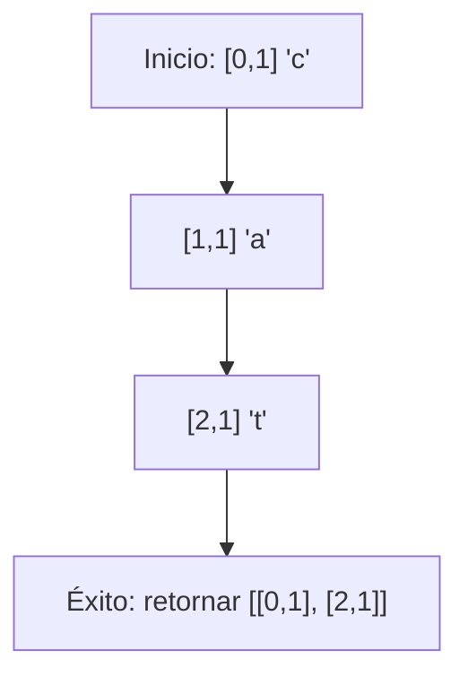

## Introducción

En este post, exploraremos un problema clásico de algoritmos: buscar una palabra específica en una matriz bidimensional de letras.
El desafío consiste en encontrar la posición de inicio y fin de una palabra que aparece en línea recta (horizontal o vertical, incluyendo direcciones invertidas) dentro de una cuadrícula de letras minúsculas.

## Enunciado del Problema

Dada una matriz bidimensional `matriz` de letras minúsculas (a-z) y una palabra objetivo `palabra`, debemos retornar las posiciones de inicio y fin de esa palabra si aparece exactamente una vez en la matriz. La palabra puede estar orientada en cualquiera de las cuatro direcciones principales:

- Derecha (horizontal)
- Izquierda (horizontal invertida)
- Abajo (vertical)
- Arriba (vertical invertida)

Si la palabra no se encuentra, retornamos `null`.

### Ejemplo

Consideremos la siguiente matriz:

```text
[
  ["a", "c", "t"],
  ["t", "a", "t"],
  ["c", "t", "c"]
]
```

Para la palabra `"cat"`, la función debe retornar `[[0, 1], [2, 1]]`, ya que la palabra aparece verticalmente desde la posición `[0, 1]` ("c") hasta `[2, 1]` ("t").

## Enfoque y Análisis

### Estrategia Inicial

Una aproximación directa es recorrer toda la matriz celda por celda. Cuando encontremos una celda que coincida con la primera letra de la palabra, exploraremos las cuatro direcciones posibles para verificar si la palabra completa se forma en esa trayectoria.

Este enfoque garantiza que encontremos la palabra si existe, ya que cubrimos todas las posiciones posibles de inicio y todas las orientaciones válidas.

### Análisis de Complejidad

- **Tiempo**: O(N × M × L), donde N es el número de filas, M el número de columnas y L la longitud de la palabra. En el peor caso, visitamos cada celda y, para cada una, verificamos hasta L letras en 4 direcciones.
- **Espacio**: O(1), ya que solo usamos variables auxiliares constantes.

### Consideraciones Especiales

- La matriz puede no ser cuadrada.
- La palabra puede estar en los bordes o esquinas.
- Debemos verificar límites en cada paso para evitar accesos fuera de rango.

## Solución Implementada

La implementación en JavaScript utiliza una función auxiliar `verificarDireccion` que, dada una posición inicial y una dirección, verifica si la palabra se forma completamente en esa dirección.

```javascript
export default function findWord(matriz, palabra) {
  // Definir las 4 direcciones posibles
  const direcciones = [
    [0, 1], // derecha
    [0, -1], // izquierda
    [1, 0], // abajo
    [-1, 0], // arriba
  ]

  function verificarDireccion(filaInicio, colInicio, deltaFila, deltaCol) {
    let fila = filaInicio
    let col = colInicio

    for (let i = 0; i < palabra.length; i++) {
      if (
        fila < 0
        || fila >= matriz.length
        || col < 0
        || col >= matriz[0].length
        || matriz[fila][col] !== palabra[i]
      ) {
        return false
      }
      fila += deltaFila
      col += deltaCol
    }
    return true
  }

  // Recorrer la matriz
  for (let i = 0; i < matriz.length; i++) {
    for (let j = 0; j < matriz[i].length; j++) {
      if (matriz[i][j] === palabra[0]) {
        for (const [deltaFila, deltaCol] of direcciones) {
          if (verificarDireccion(i, j, deltaFila, deltaCol)) {
            const filaFin = i + deltaFila * (palabra.length - 1)
            const colFin = j + deltaCol * (palabra.length - 1)
            return [[i, j], [filaFin, colFin]]
          }
        }
      }
    }
  }

  return null
}
```

### Diagrama de Ejecución

Para ilustrar el proceso, veamos cómo se encuentra "cat" en el ejemplo:



## Conclusión

Este algoritmo nos enseña a manejar recorridos direccionales en matrices, un patrón común en problemas de búsqueda y grafos. La clave está en verificar sistemáticamente todas las posibilidades mientras mantenemos la eficiencia.

Los conceptos aplicados incluyen:

- **Manejo de índices y límites de matrices**: En la función `verificarDireccion`, verificamos en cada iteración que `fila` y `col` estén dentro de los límites válidos (`fila >= 0 && fila < matriz.length && col >= 0 && col < matriz[0].length`) antes de acceder a `matriz[fila][col]`, evitando errores de índice.
- **Exploración en múltiples direcciones**: Definimos un array `direcciones` con los desplazamientos para las cuatro direcciones posibles (derecha, izquierda, abajo, arriba) y, desde cada posición que coincide con la primera letra, probamos cada dirección para formar la palabra completa.
- **Verificación incremental de condiciones**: En el bucle de `verificarDireccion`, avanzamos paso a paso verificando cada letra de la palabra, deteniéndonos inmediatamente si hay una discrepancia o si se alcanza un límite, lo que optimiza el proceso al fallar rápido.
